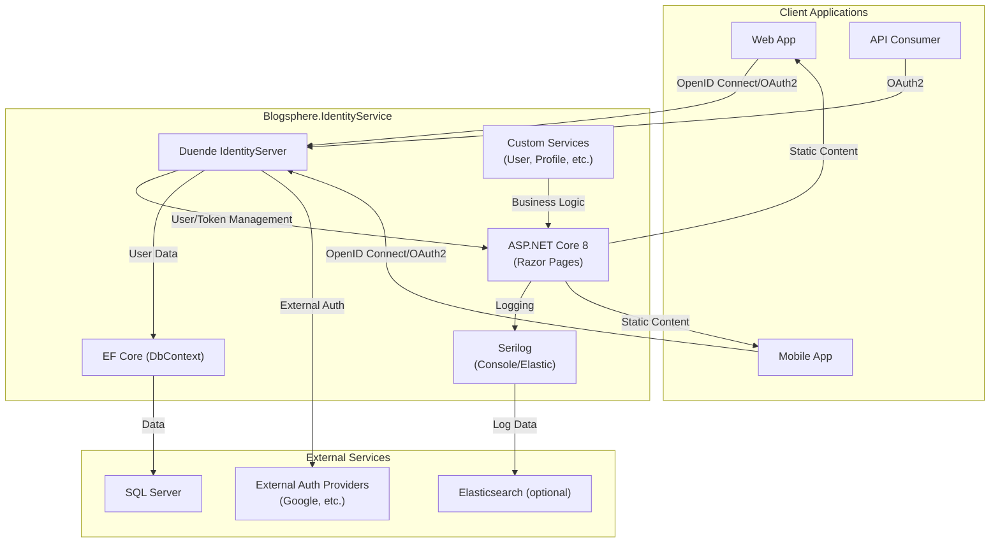

# Blogsphere.IdentityService

**Blogsphere.IdentityService** is a robust, extensible authentication and authorization microservice built with ASP.NET Core 8 and Duende IdentityServer. It provides secure user management, role-based access control, and supports modern authentication protocols (OpenID Connect, OAuth2) for the Blogsphere platform and other clients.

---

## Table of Contents

-   [Features](#features)
-   [Architecture](#architecture)
-   [Getting Started](#getting-started)
    -   [Prerequisites](#prerequisites)
    -   [Configuration](#configuration)
    -   [Database Seeding](#database-seeding)
    -   [Running Locally](#running-locally)
    -   [Docker](#docker)
-   [Project Structure](#project-structure)
-   [Extensibility](#extensibility)
-   [Security](#security)
-   [License](#license)
-   [References](#references)

---

## Features

-   **User Authentication**: Local and external (e.g., Google) login support.
-   **Role-Based Access Control**: Custom roles (Admin, Editor, Author, Subscriber) and fine-grained permissions.
-   **OpenID Connect & OAuth2**: Standards-based authentication for secure API and web access.
-   **Profile & Image Management**: Extensible user profile and image details.
-   **Secure Token Handling**: Data protection and custom token providers.
-   **Logging & Telemetry**: Serilog integration with console and Elasticsearch sinks.
-   **Database Migrations & Seeding**: Automated on first run in development.
-   **Docker Support**: Production-ready containerization.

---

## Architecture

-   **ASP.NET Core 8** with Razor Pages.
-   **Duende IdentityServer** for authentication and authorization.
-   **Entity Framework Core** for data access (SQL Server).
-   **Serilog** for structured logging.
-   **Elasticsearch** (optional) for log aggregation.
-   **Docker** for containerized deployments.

---

## Architecture Diagram



---

## Getting Started

### Prerequisites

-   [.NET 8 SDK](https://dotnet.microsoft.com/download)
-   [SQL Server](https://www.microsoft.com/en-us/sql-server/sql-server-downloads) (local or remote)
-   [Docker](https://www.docker.com/) (optional, for containerization)
-   [Node.js/NPM](https://nodejs.org/) (optional, for front-end development)

### Configuration

All configuration is managed via `appsettings.json`:

```json
{
  "Logging": { ... },
  "AppConfigurations": {
    "ApplicationIdentifier": "Blogsphere.IdentityServer",
    "ApplicationEnvironment": "Development"
  },
  "ElasticSearch": {
    "Uri": "http://localhost:9200"
  },
  "ConnectionStrings": {
    "Sqlserver": "Server=localhost,1433;Database=IdentityDb;User Id=sa;Password=P@ssw0rd;Encrypt=True;TrustServerCertificate=True;"
  }
}
```

-   **ConnectionStrings.Sqlserver**: Update with your SQL Server credentials.
-   **ElasticSearch.Uri**: Optional, for log aggregation.

### Database Seeding

On first run in development, the service will:

-   Apply any pending migrations.
-   Seed default roles, permissions, and demo users (see `SeedData.cs`).

**Default users:**

-   Admin: `sharthak123` / `P@ssw0rd`
-   Editor: `john123` / `P@ssw0rd`
-   Author: `david100` / `P@ssw0rd`
-   Subscriber: `henry200` / `P@ssw0rd`

### Running Locally

1. **Restore & Build:**

    ```bash
    dotnet restore
    dotnet build
    ```

2. **Run the Service:**

    ```bash
    dotnet run --project src/IdentityService/IdentityService.csproj
    ```

    The service will be available at [http://localhost:5000](http://localhost:5000).

3. **Access the Discovery Document:**
    - [http://localhost:5000/.well-known/openid-configuration](http://localhost:5000/.well-known/openid-configuration)

### Docker

To build and run the service in Docker:

```bash
docker build -t blogsphere-identityservice -f src/IdentityService/Dockerfile .
docker run -p 8080:8080 --env ASPNETCORE_ENVIRONMENT=Development blogsphere-identityservice
```

Or use the provided `docker-compose.yml` for multi-service orchestration.

---

## Project Structure

```
src/
  IdentityService/
    Config.cs                # IdentityServer in-memory config (clients, scopes, resources)
    Program.cs               # Entry point and startup logic
    Entities/                # User, Role, Permission, Profile, Image models
    Data/                    # EF Core DbContext, migrations
    Services/                # Custom profile service, etc.
    Configurations/          # App, logging, and ElasticSearch configs
    Pages/                   # Razor Pages for login, consent, diagnostics, etc.
    wwwroot/                 # Static assets (CSS, JS, images)
    Dockerfile               # Container build instructions
    appsettings.json         # Main configuration file
```

---

## Extensibility

-   **User Model**: `ApplicationUser` extends `IdentityUser` with profile, image, and activity fields.
-   **Roles & Permissions**: Easily add new roles/permissions in `SeedData.cs` and `Constants.cs`.
-   **External Providers**: Add new OAuth providers via configuration and `AppConfigurations`.
-   **Logging**: Extend or change sinks in `Logging.cs` and `appsettings.json`.

---

## Security

-   **Data Protection**: Keys stored in the database for distributed deployments.
-   **Token Providers**: Custom email and password reset token providers.
-   **CORS**: Configurable origins for secure API access.
-   **Environment Separation**: Seeding and debugging only in development.

---

## License

This project is licensed under the MIT License. See the [LICENSE](../LICENSE) file for details.

---

## References

-   [Duende IdentityServer Documentation](https://docs.duendesoftware.com/identityserver/v6/)
-   [ASP.NET Core Identity](https://learn.microsoft.com/en-us/aspnet/core/security/authentication/identity)
-   [Serilog](https://serilog.net/)
-   [Elasticsearch](https://www.elastic.co/elasticsearch/)
-   [Docker](https://docs.docker.com/)

---

**For questions, issues, or contributions, please open an issue or pull request.**
